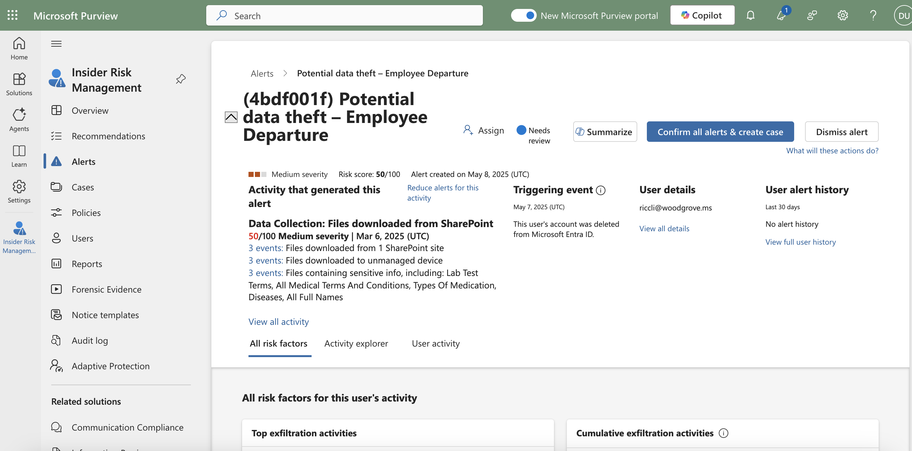
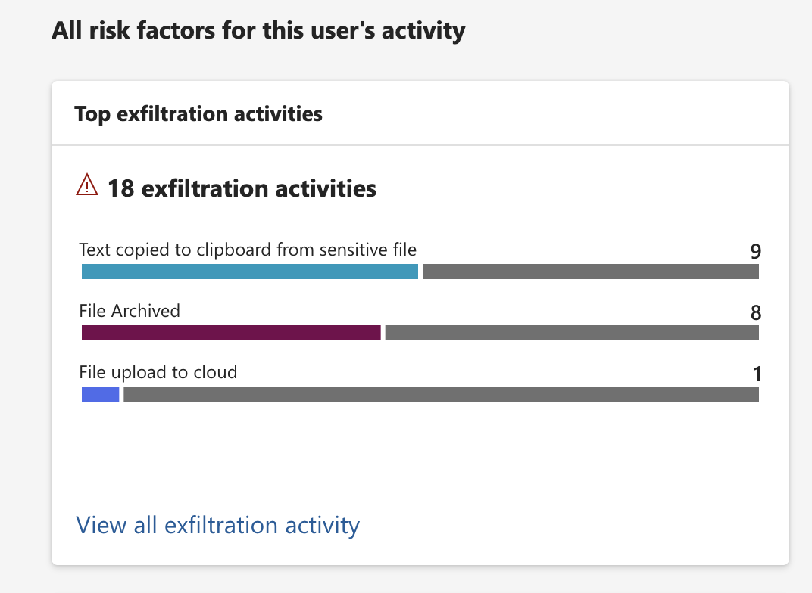
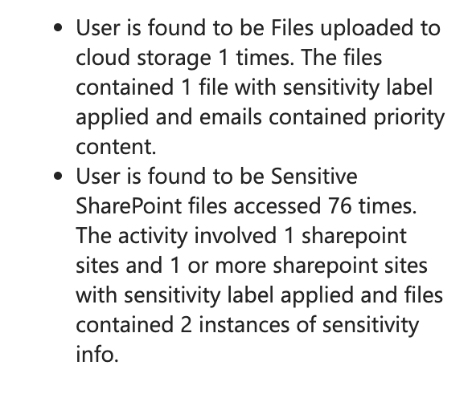
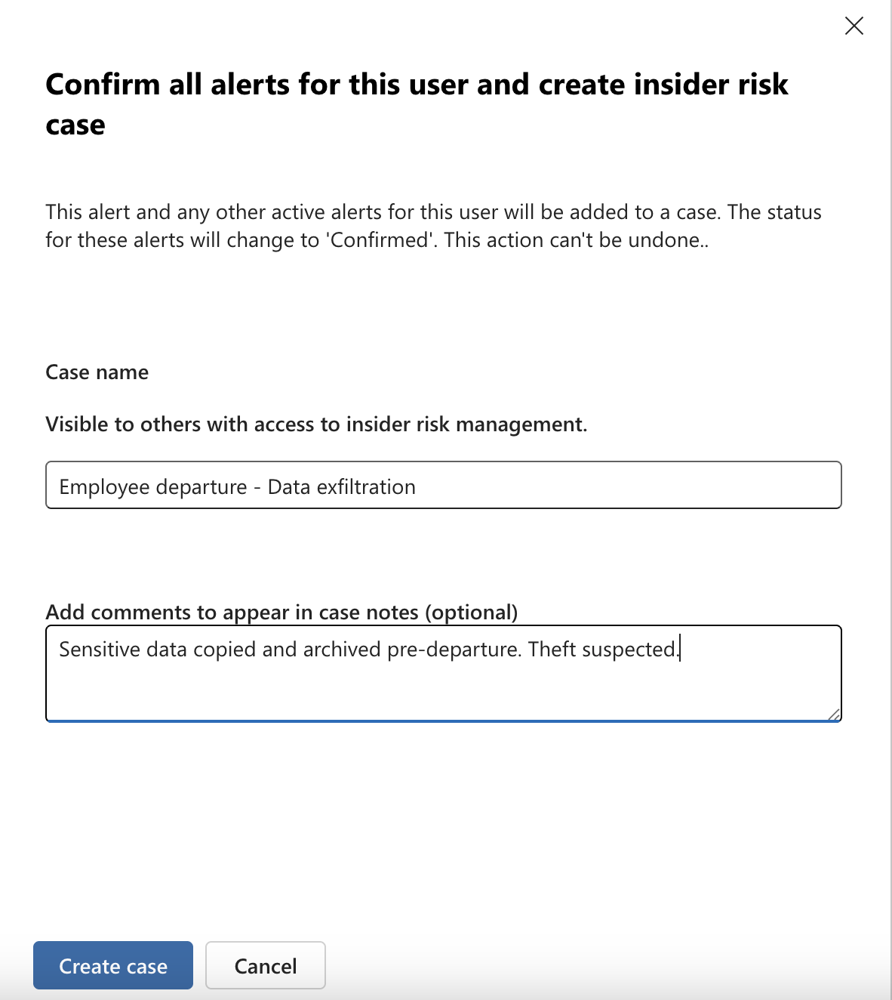
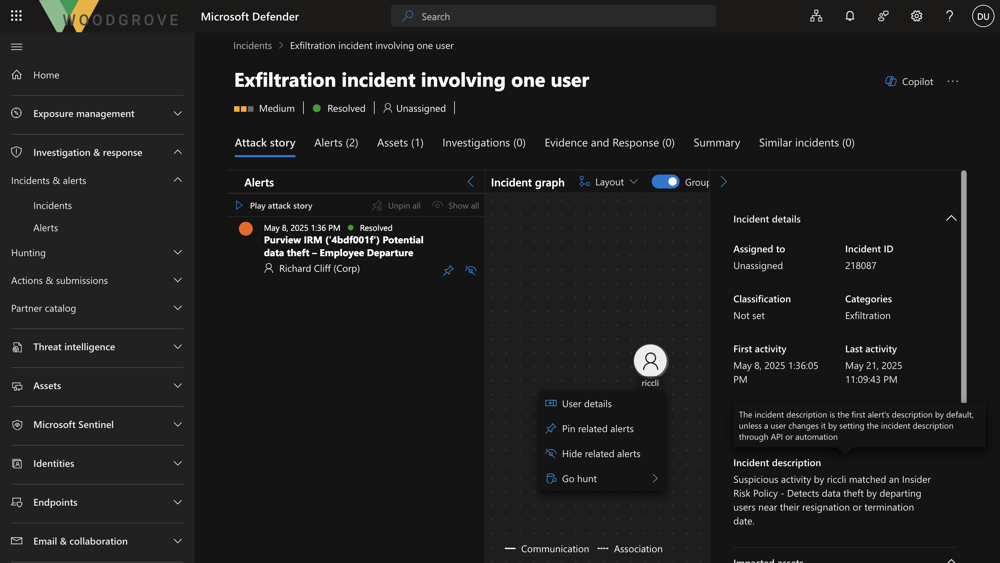
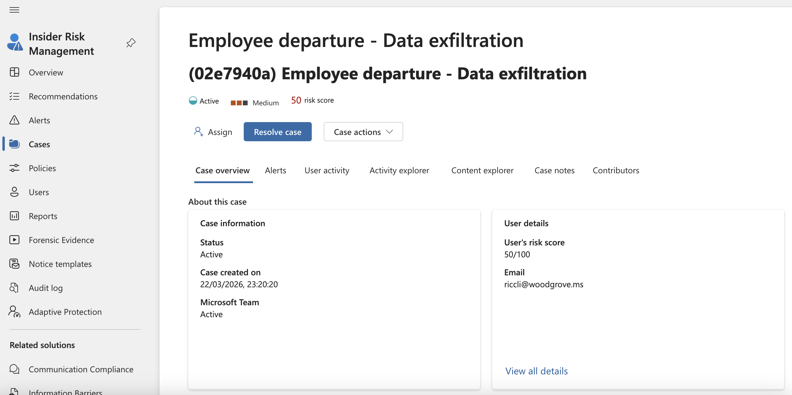

# 🔍 Microsoft Purview Insider Risk Investigation

This project documents a simulated insider threat investigation using Microsoft Purview and Microsoft Defender. The investigation covers alert triage, user activity analysis, case escalation, and cross-platform incident correlation.

---

## 🚨 Scenario

An alert titled:

**"Potential data theft – Employee Departure"**

was triggered due to suspicious user activity involving sensitive data access and downloads from SharePoint.

---

## 🎯 Objective

To investigate a potential insider threat involving data exfiltration prior to employee departure and determine the risk level and appropriate response.

---

## 🛠️ Tools Used

- Microsoft Purview (Insider Risk Management)
- Microsoft Defender (XDR)
- Activity Explorer
- Copilot (for assisted analysis)

---

## 🔎 Investigation overview

### 1. Alert Triage (Microsoft Purview)

- Reviewed alert details and risk indicators
- Identified:
  - High volume of sensitive file access
  - Files downloaded to unmanaged device
  - Access to PII and confidential data

---

### 2. User Activity Analysis

Key findings:
- Hundreds of sensitive files accessed
- File renaming (possible obfuscation)
- File deletion (possible cleanup)
- Data accessed included:
  - Passport information
  - API keys
  - Personal data

---

### 3. Case Escalation

- Created insider risk case:
  **"Employee departure – Data exfiltration"**

- Escalated for investigation via eDiscovery

**Justification:**
- Data staging behavior
- High-risk data exposure
- Activity occurring before account deletion

---

### 4. Cross-Platform Correlation (Microsoft Defender)

- Identified correlated incident:
  **"Exfiltration incident involving one user"**

- Defender aggregated:
  - Insider risk alerts
  - User activity signals
  - Incident timeline

---

## 🔍 Investigation evidence

### 1. Alert Overview

Initial alert triggered for potential data exfiltration related to an employee departure.

---

### 2. User Activity Analysis

Analysis of user activity revealed multiple exfiltration behaviors including file downloads, archiving, and clipboard activity.

---

### 3. Copilot Summary

Copilot provided a summarized overview of suspicious activity to assist triage.

---

### 4. Case Creation

All alerts were confirmed and escalated into an insider risk case.

---

### 5. Incident Correlation (Microsoft Defender)

The activity was correlated with Microsoft Defender, confirming broader security impact.

---

### 6. Case Dashboard

Final case view showing consolidated alerts and investigation status.

---

## 🧠 Analyst Assessment

The activity strongly indicates **insider-driven data staging and potential exfiltration prior to employee departure**.

Although initially rated as medium risk, the combination of:
- High-volume sensitive data access
- File manipulation (renaming and deletion)
- Data transfer indicators (downloads, uploads, clipboard activity)

suggests a **high-confidence insider threat scenario**.

While account deletion was observed, this may be consistent with standard offboarding procedures. However, its timing in relation to suspicious data activity increases the overall risk profile.

---

## 🤖 Copilot-Assisted Insights

Copilot identified:
- Repeated access to sensitive SharePoint data
- File uploads to cloud storage
- Risk indicators aligned with insider threat patterns

These findings supported and validated the manual investigation.

---

## ✅ Outcome

- Case escalated for investigation  
- Incident correlated in Microsoft Defender  
- Final classification:
  **Confirmed policy violation (data exfiltration)**  

- Action taken:
  - HR notified
  - Case resolved

---

## 🚀 Key Skills Demonstrated

- Alert triage  
- Insider threat detection  
- Data exfiltration analysis  
- Incident escalation  
- Cross-platform correlation (Purview + Defender)  
- SOC documentation  

---
